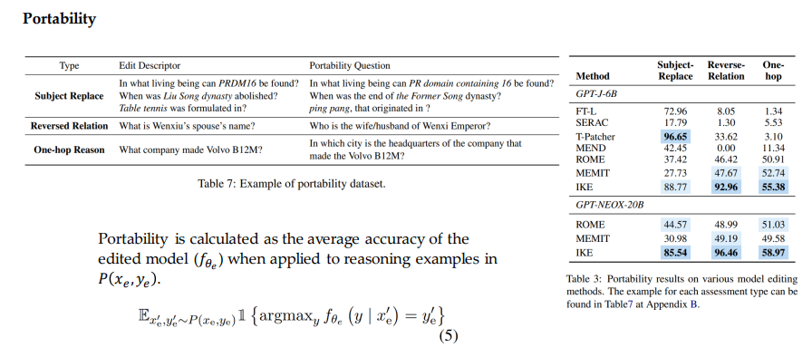
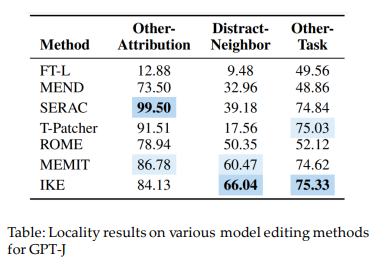
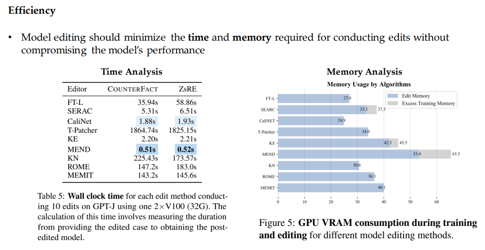
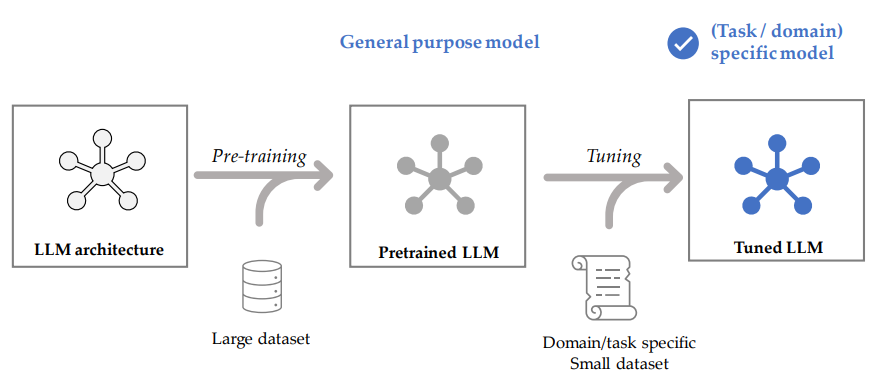
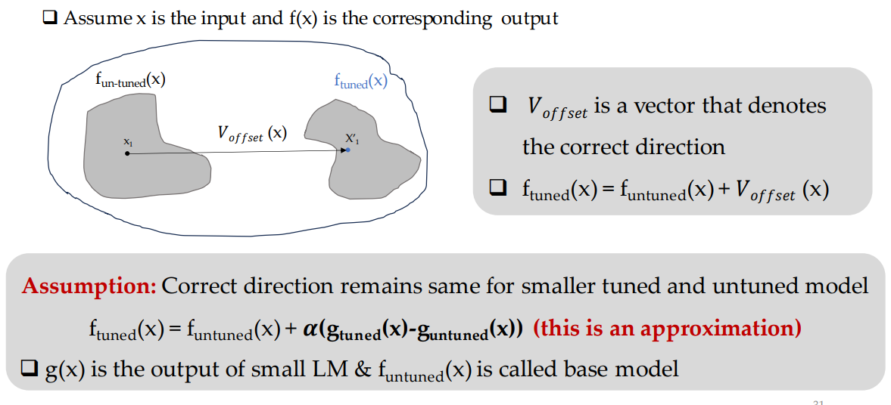
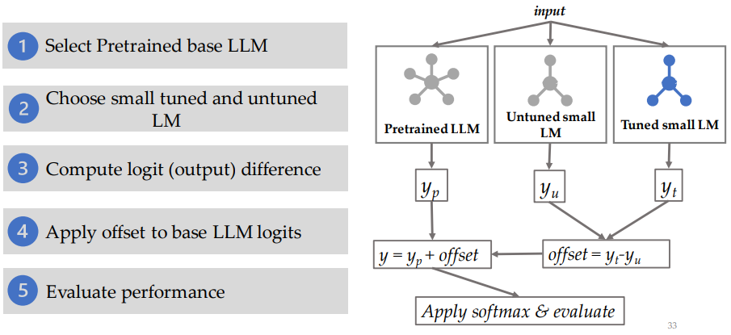
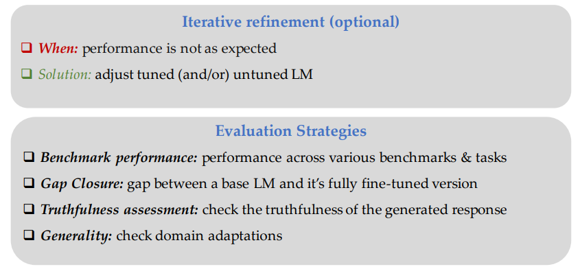

In this session, our readings cover: 

## Required Readings: 

### Editing Large Language Models: Problems, Methods, and Opportunities
+ https://arxiv.org/abs/2305.13172
+ Yunzhi Yao, Peng Wang, Bozhong Tian, Siyuan Cheng, Zhoubo Li, Shumin Deng, Huajun Chen, Ningyu Zhang
Despite the ability to train capable LLMs, the methodology for maintaining their relevancy and rectifying errors remains elusive. To this end, the past few years have witnessed a surge in techniques for editing LLMs, the objective of which is to efficiently alter the behavior of LLMs within a specific domain without negatively impacting performance across other inputs. This paper embarks on a deep exploration of the problems, methods, and opportunities related to model editing for LLMs. In particular, we provide an exhaustive overview of the task definition and challenges associated with model editing, along with an in-depth empirical analysis of the most progressive methods currently at our disposal. We also build a new benchmark dataset to facilitate a more robust evaluation and pinpoint enduring issues intrinsic to existing techniques. Our objective is to provide valuable insights into the effectiveness and feasibility of each editing technique, thereby assisting the community in making informed decisions on the selection of the most appropriate method for a specific task or context. Code and datasets are available at this https URL.
Comments: EMNLP 2023. Updated with new experiments

## More Readings: 

### Tuning Language Models by Proxy
+ Alisa Liu, Xiaochuang Han, Yizhong Wang, Yulia Tsvetkov, Yejin Choi, Noah A. Smith
+ Submitted on 16 Jan 2024]
+ Despite the general capabilities of large pretrained language models, they consistently benefit from further adaptation to better achieve desired behaviors. However, tuning these models has become increasingly resource-intensive, or impossible when model weights are private. We introduce proxy-tuning, a lightweight decoding-time algorithm that operates on top of black-box LMs to achieve the result of directly tuning the model, but by accessing only its prediction over the output vocabulary. Our method instead tunes a smaller LM, then applies the difference between the predictions of the small tuned and untuned LMs to shift the original predictions of the base model in the direction of tuning, while retaining the benefits of larger scale pretraining. In experiments, when we apply proxy-tuning to Llama2-70B using proxies of only 7B size, we can close 88% of the gap between Llama2-70B and its truly-tuned chat version, when evaluated across knowledge, reasoning, and safety benchmarks. Interestingly, when tested on TruthfulQA, proxy-tuned models are actually more truthful than directly tuned models, possibly because decoding-time guidance better retains the model's factual knowledge. We then demonstrate the generality of proxy-tuning by applying it for domain adaptation on code, and task-specific finetuning on question-answering and math problems. Our work demonstrates the promise of using small tuned LMs to efficiently customize large, potentially proprietary LMs through decoding-time guidance.

### A Survey of Machine Unlearning
  + https://arxiv.org/abs/2209.02299
  + Today, computer systems hold large amounts of personal data. Yet while such an abundance of data allows breakthroughs in artificial intelligence, and especially machine learning (ML), its existence can be a threat to user privacy, and it can weaken the bonds of trust between humans and AI. Recent regulations now require that, on request, private information about a user must be removed from both computer systems and from ML models, i.e. ``the right to be forgotten''). While removing data from back-end databases should be straightforward, it is not sufficient in the AI context as ML models often `remember' the old data. Contemporary adversarial attacks on trained models have proven that we can learn whether an instance or an attribute belonged to the training data. This phenomenon calls for a new paradigm, namely machine unlearning, to make ML models forget about particular data. It turns out that recent works on machine unlearning have not been able to completely solve the problem due to the lack of common frameworks and resources. Therefore, this paper aspires to present a comprehensive examination of machine unlearning's concepts, scenarios, methods, and applications. Specifically, as a category collection of cutting-edge studies, the intention behind this article is to serve as a comprehensive resource for researchers and practitioners seeking an introduction to machine unlearning and its formulations, design criteria, removal requests, algorithms, and applications. In addition, we aim to highlight the key findings, current trends, and new research areas that have not yet featured the use of machine unlearning but could benefit greatly from it. We hope this survey serves as a valuable resource for ML researchers and those seeking to innovate privacy technologies. Our resources are publicly available at this https URL.

### AI Model Disgorgement: Methods and Choices
  + https://arxiv.org/abs/2304.03545
  + Alessandro Achille, Michael Kearns, Carson Klingenberg, Stefano Soatto
Responsible use of data is an indispensable part of any machine learning (ML) implementation. ML developers must carefully collect and curate their datasets, and document their provenance. They must also make sure to respect intellectual property rights, preserve individual privacy, and use data in an ethical way. Over the past few years, ML models have significantly increased in size and complexity. These models require a very large amount of data and compute capacity to train, to the extent that any defects in the training corpus cannot be trivially remedied by retraining the model from scratch. Despite sophisticated controls on training data and a significant amount of effort dedicated to ensuring that training corpora are properly composed, the sheer volume of data required for the models makes it challenging to manually inspect each datum comprising a training corpus. One potential fix for training corpus data defects is model disgorgement -- the elimination of not just the improperly used data, but also the effects of improperly used data on any component of an ML model. Model disgorgement techniques can be used to address a wide range of issues, such as reducing bias or toxicity, increasing fidelity, and ensuring responsible usage of intellectual property. In this paper, we introduce a taxonomy of possible disgorgement methods that are applicable to modern ML systems. In particular, we investigate the meaning of "removing the effects" of data in the trained model in a way that does not require retraining from scratch.

### Outline

- The presenters discussed 3 primary topics:
1. Editing Large Language Models
2. Tuning Language Models by Proxy
3. A survey of Machine Unlearning

## Paper 1: Editing Large Language Models

### Context

As is visible from the graph, LLMs have seen a meteoric rise in recent times. This graph relates the number of parameters in models to time, by year since 2020. It also shows which models are available with open access, and shows larger circles for models with more parameters. 

### Unwanted Knowledge

LLMs can easily learn unwanted knowledge. If given poor input data, it can output biased responses. The authors will discuss if there is an efficient way for large language models to update their knowledge.

Editing LLMs is necessary because the world changes after they are released. Labels shift, and the ground truth for their answers can shift as well. 

The authors discuss 3 primary ways of updating a model:
1. Fine-tuning: drawbacks include its computational requirements and how easy it is to overfit.
2. Retrieval augmented: can scale poorly and suffer from retrieval noise
3. Model editing: gives precise control, but can be difficult and ineffective.

In this slide the presenters formally describe the task at hand. The goal is to modify a model's behavior for one particular edit descriptor while leaving other behaviors unchanged. The edit scope is also formally defined with *S*, and behaviors can either be in-scope or out-of-scope. 

For evaluation, the authors primarily use metrics of reliability, generalization, and locality.

#### Current Methods

This slide shows how current methods could be used to modify an edit descriptor in a model. The upper section shows a method to modify the behavior while preserving the model's parameters. The lower section shows a method wherein the model's parameters are modified. 

The authors present this table to compare the current methods and specify additional attributes of their approaches. 

The authors now experiment with the different approaches. Their experiments are based on factual knowledge, which is information that can be verified as true or false based on empirical evidence or authoritative sources. 

The authors will utilize the CounterFact dataset to measure the efficacy of significant changes. This slide also shows the composition of that dataset.

#### Experimental Results

This slide shows the results of existing methods on three metrics of the dataset: reliability, generalization, and locality. 

In terms of scaling, the authors note that the ROME and MEMEIT approaches perform well on the GPT-NEOX-20B model but fail on OPT-13B. They note that large amounts of matrix computations and in-context learning ability could limit the efficacy of certain approaches. 

Batch editing is required to modify a model with multiple knowledge pieces simultaneously. Some methods are batch-editing-supportive. Figure 3 shows batch editing performance vs. batch number. MEMEIT appears to be one of the best approaches in this regard. 

#### Preliminary Experiments
Sequential Editing
- The ability to carry out successive edits is a vital feature for model editing
- Methods that freeze the model's parameters, like SERAC and T-Patcher, generally show stable performance in sequential editing
- Those altering the model's parameters struggle, e.g., ROME and MEND

#### Comprehensive Study
Proposed more comprehensive evaluations regarding portability, locality, and efficiency.
Portability-Robust Generalization
- Crucial to verify if these methods can handle the implication of an edit for realistic applications
- Definition: Gauge the effectiveness of model editing in transferring knowledge to related content, termed robust generalization
- Three aspects:
1. Subject replace: replacing the subject in the question with an alias or synonym
2. Reversed relation: If the target of a subject and relation is edited, attribute of the target entity also changes
3. One-hop: Modified knowledge should be usable by the edited language model for downstream tasks

Locality Side Effect of Model Editing

- Evaluate potential side-effects of model editing.
- Other relations: Argue that other attributes of the subject that have been updated should remain unchanged after editing.
- Distract Neighborhood: If edited cases are concatenated or presented before unrelated input to the model, the model tends to be "swayed" or influenced by those edited cases.

#### Limitations
- Model Scale: Computational Complexities
- Different architectures need to be explored: Llama
- Editing Scope: Application of model editing goes beyond mere factual contexts
- Elements such as personality, emotions, opinions, and beliefs also fall within the scope of model editing
- Editing Setting: Multi-edit evaluation
- Zhong et al. (2023) proposed a multi-hop reasoning setting that explored current editing methods' generalization performance for multiple edits simultaneously
- Editing Black-Box LLMs: Utilize in-context learning or prompt-based methods to modify these LLMs

### Paper II: Tuning Language Model by Proxy
#### Model Fine-tuning

#### Idea of Proxy-Tuning

#### What is proxy-tuning?

Decoding-time algorithm that adapts LLMs without accessing their internal weights\
Uses only the base model's (LLM) output predictions

#### How does it work?

#### Performance Evaluation

#### Example of Proxy-tuning 

#### Generated response from Proxy-tuning

#### Computational Complexity

#### General Results

Different models are tested on GSM and AlpacaFarm datasets. The results show that while
both Base and 70B-Base models are struggling, the proxy-tuned 70B-Base model has drastic improvement in performance
as well as generating less toxic responses.

#### TruthfulQA Detailed Results

The models are also tested on Truthful QA dataset, which has two aspects, truthfulness and informativeness. 
Truthfulness is a measurement on answer to question does not assert a false statement. (does not give any 
factually incorrect answer) while informativeness is a measurement on provided information that reduces uncertainty 
raised by question.

It shows that the proxy-tuned models are more truthful though slightly less informative which implies  decoding-time 
algorithms may preserve knowledge better than direct finetuning.

#### Code Adaptation Experiments

The authors also test the proxy-tuning on code adaptation. They used Codellama-7B-python as the base model and compared
the results with proxy-tuning again direct tuning. The evaluation datasets are CodexEval and DS-1000.

The results show that the proxy-tuned model does not outperform the directly tuned model on code adaptation. The authors 
deduced that it can be due to that the base model itself is already tuned on a specific task and that Proxy-tuning needs 
more work for code generation applications.

#### Task Finetuning Experiments

LMs usually do not perform ideally on out-of-the-box tasks. The authors test the proxy-tuning on two tasks which requires 
some sort of tuning. The datasets are TriviaQA and GSM, one is a question-answering task and the other is a math question 
task. The models are LLAMA2-7B finetuned on trainset to obtain a task expert. Anti expert is another LLAMA2-7B model.

The results show that the proxy-tuned model does not outperform the directly tuned model on both datasets.

#### Analysis of proxy tuning at the token level

To understand what kinds of tokens are influenced more by proxy-tuning, the authors recorded next-token 
probability distribution at each time step and then took the difference in probabilities assigned to the 
top token xt chosen by the proxy-tuned model. The analysis is based on 12B-Base and its proxy-tuned model.

For GSM, all the intermediate equations' left-hand side and the right-hand side are compared to the references where 
there is a single correct answer. the probability difference is 0.130 on average for LHS tokens, 
and 0.056 for RHS tokens, a difference which is statistically significant with p < 0.0001 under a t-test.

It shows that proxy tuning contributes more to formulating reasoning steps than to generating factual statements.

For TruthfulQA, the authors recorded the tokens most influenced by proxy tuning. It shows that instruction tuning 
mainly influences reasoning and style instead of increasing the model’s knowledge as can be seen in the two 
examples, where the changes are more of stylistic nature.

To study if hyperparameters can provide more control over proxy tuning, especially in terms of the 
trade-off between informativeness and truthfulness. The authors used TruthfulQA dataset as the example, and the 
hyperparameter α is between 0.2 and 2, the larger it is the more contrast there is between the expert and
anti-expert.

It shows that the informativeness decreases as α increases, while the truthfulness increases. There is
some optimum value existing for a specific dataset.

#### Conclusion

The authors concluded that proxy-tuning is a promising method for the decoding-time by modifying output logits, an 
efficient alternative to direct finetuning and a viable method to fine-tuning proprietary models.

As full finetuning might lead to forgetting old information, proxy tuning might open a new method of continual 
learning since it is more efficient.

### A Survey of Machine Unlearning

#### "The Right to be Forgotten"

It can be argued that everyone should have “The right to have private information about a person be removed from Internet searches and other 
directories under some circumstances”. As individuals tend to change and develop throughout the time and events from the 
past can still cause stigma and consequences even many years later when the person has changed or the information is no longer
relevant or true.

#### Machine Unlearning

This concept should also be applied to machine learning models. As models are tend to be trained on past data, the 
information that should be unlearned is both in the dataset and the model's parameters. Thus this poses a question
of how to unlearn the data from the model.

#### Reasons for Machine Unlearning

There are several reasons of why machine unlearning can be beneficial: 1. Improve security of the Model; 2. Improve 
privacy of User; 3. Improve Usability of System and 4. Reduce Bias in the Model.

#### Machine Unlearning Challenges

There are also some challenges in machine unlearning: 1. As a model is trained on mini-batches, it is hard to 
find all the batches that contain the data to be unlearned; 2. A model is trained in an incremental way, so the data
point to be unlearned also has influence on the later data points; 3. A model that has unlearned the data tends to perform
way worse than the original model.

#### Machine Unlearning Definition (Exact/Perfect)

To define machine unlearning in a mathematical way, it can be defined that after the unlearning process the model
Pr(U(D,D,Df,A(D))) should have the same probability distribution as the model Pr(A(D\Df)) which represents the model 
trained on the datset without the forget set. And this is Exact Unlearning.

#### Unlearning Definition (Approximate)

The approximate unlearning however, lossens the constraint. It states that the unlearned model distribution should be
approximately equal to the model distribution trained on the dataset without the forget set to start with. More specifically,
this is defined as a ratio between the two models and the ration should be smaller than a predefined threshold.

#### Differential Privacy and Approximate Unlearning

There is also a close relationship between differential privacy and approximate unlearning. Differential privacy implies 
approximate unlearning however, the reverse is not true.

